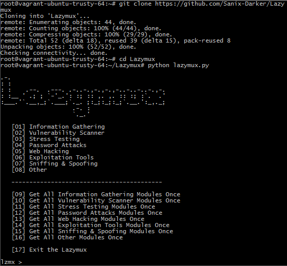

# Lazymux
Lazymux tools installer is very easy to use, only provided for lazy termux users; it's huge list of Many Hacking tools and PEN TESTING!
**NOTE: Am not Responsible of bad use of this project.**

## Screenshot


### Requirements
• Linux environment<br>
• Python 2.x<br>
• git<br>

#### Installation and Using Lazymux
```shell
git clone https://github.com/YoungStoney/Lazymux-Tools-Installer
 
cd Lazymux

python2 lazymux.py
# OR
python lazymux.py
```

#### Authors
• [YoungStoney](https://github.com/YoungStoney)

#### Contributors
• [Sanix-darker](https://github.com/Sanix-Darker)
